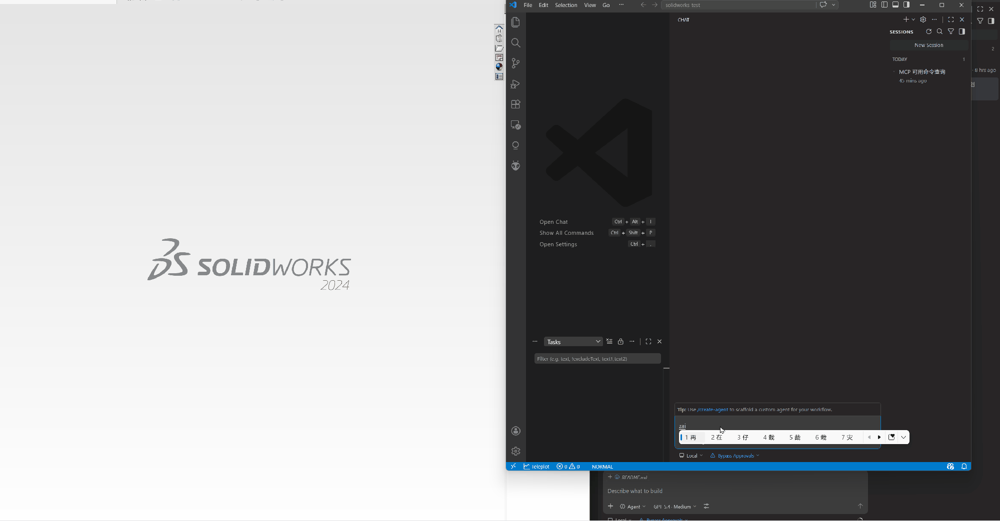

# SolidWorks MCP Server

[](./README.md)

SolidWorks MCP Server 是专为 Windows 设计的 SolidWorks MCP 桌面自动化服务，供 VS Code、Claude Desktop 以及其他 MCP 客户端调用。

## 演示



项目以单一 exe 的形式交付，但运行时分为两种模式：

- Hub 模式：托盘常驻进程，持有共享的 SolidWorks COM / STA 执行环境。
- Proxy 模式：供 VS Code、Claude Desktop 等 MCP 客户端拉起的 stdio MCP 入口。

Proxy 通过本地 Named Pipe 与托盘 Hub 通信；如果 Hub 尚未启动，Proxy 会自动唤醒它。

## 项目目标

- 给 AI 代理提供稳定的 SolidWorks 自动化接口。
- 把 CAD 操作拆成小而明确的工具。
- 把 MCP 协议层和 SolidWorks COM 执行层解耦。
- 运行时不占用前台窗口，以托盘图标的形式常驻后台。

## 当前能力

- 文档工具：连接、创建、打开、保存、关闭、列出、查询活动文档。
- 选择工具：按名称选择、拓扑枚举、按索引精确选择、清空选择。
- 草图工具：点、椭圆、多边形、文本、线、圆、矩形、圆弧。
- 特征工具：拉伸、切除、旋转、圆角、倒角、抽壳、简单孔。
- 装配工具：插入组件、列出组件、核心配合工具。

## 环境要求

- Windows 10/11
- 本机已安装 SolidWorks
- [.NET 8 运行时](https://dotnet.microsoft.com/download/dotnet/8.0)（源码构建需要 .NET 8 SDK）
- VS Code 或 Claude Desktop（MCP 客户端）

## 快速开始

### 直接运行 Release 包

从 [Releases](../../releases) 页下载 `SolidWorksMcpApp.exe`，双击启动。  
服务以托盘图标常驻，右键可导出 Claude Desktop 或 VS Code 配置，也可手动复制。

> 服务在首次启动时会自动将配置写入 Claude Desktop 和 VS Code 的配置文件，无需手动操作。

### 从源码构建

```powershell
cd app/SolidWorksMcpApp
dotnet build -c Release
```

编译产物位于 `bin/Release/net8.0-windows/win-x64/SolidWorksMcpApp.exe`。

### 在 VS Code 中使用

右键托盘图标 → **导出 VSCode 配置**，将内容粘贴到 `settings.json` 中；  
或直接使用首次启动时自动写入的配置项。

### 在 Claude Desktop 中使用

右键托盘图标 → **导出 Claude 配置**，将内容粘贴到 `%APPDATA%\Claude\claude_desktop_config.json`；  
或直接使用首次启动时自动写入的配置项。

## 托盘菜单说明

| 菜单项 | 说明 |
|--------|------|
| 状态: 运行中 / 已暂停 | 当前服务状态 |
| 启动 | 从暂停状态恢复，开始接受工具调用 |
| 暂停 | 暂停接受工具调用（不退出进程） |
| 导出 VSCode 配置 | 生成 VS Code `settings.json` 片段并复制到剪贴板 |
| 导出 Claude 配置 | 生成 Claude Desktop `claude_desktop_config.json` 片段并复制到剪贴板 |
| 查看出错日志 | 在记事本中打开本次会话的错误日志 |
| 退出 | 关闭托盘和服务进程 |

> 菜单语言自动跟随 Windows 显示语言（当前支持简体中文和英文）。

## 仓库结构

```text
solidworks-mcp-server/
├─ app/SolidWorksMcpApp/  # C# MCP 服务 exe（托盘程序，stdio 传输）
├─ bridge/               # C# SolidWorks COM bridge 和测试
└─ .vscode/              # 本地开发用 MCP 配置
```

## 测试

```powershell
cd bridge
dotnet test SolidWorksBridge.sln
```

## 开发说明

- MCP 通过 `content[].text` 返回 JSON 文本结果。
- MCP 客户端实际连接的是 `SolidWorksMcpApp.exe --proxy`；若托盘 Hub 未运行，会由 Proxy 自动启动。
- `sw_extrude` / `sw_extrude_cut` 要求在草图编辑态下调用。
- 错误日志写入 exe 同级目录的 `logs/{MachineName}_{timestamp}.txt`。
- 服务在首次启动时会自动写入 `mcpServers.solidworks` 到 Claude Desktop 和 VS Code 配置中。

## 发布检查清单

1. 在 [bridge](bridge) 执行 `dotnet test SolidWorksBridge.sln`。
2. 每次 push 后，从 `.github/workflows/beta.yml` 下载 beta 构建产物。
3. 发布 GitHub Release 后，由 `.github/workflows/release.yml` 自动附加单个 `SolidWorksMcpApp-<tag>-win-x64.exe` 文件。

## GitHub Actions

- `.github/workflows/ci.yml`：PR 校验工作流，负责构建 .NET 应用并运行 bridge 单元测试。
- `.github/workflows/beta.yml`：每次 push 时构建 beta 单文件 exe 工件。
- `.github/workflows/release.yml`：每次发布 GitHub Release 时构建并上传单个正式 exe 资产。
- `.github/workflows/solidworks-self-hosted.yml`：需要安装 SolidWorks 的自托管 runner 的手动工作流。